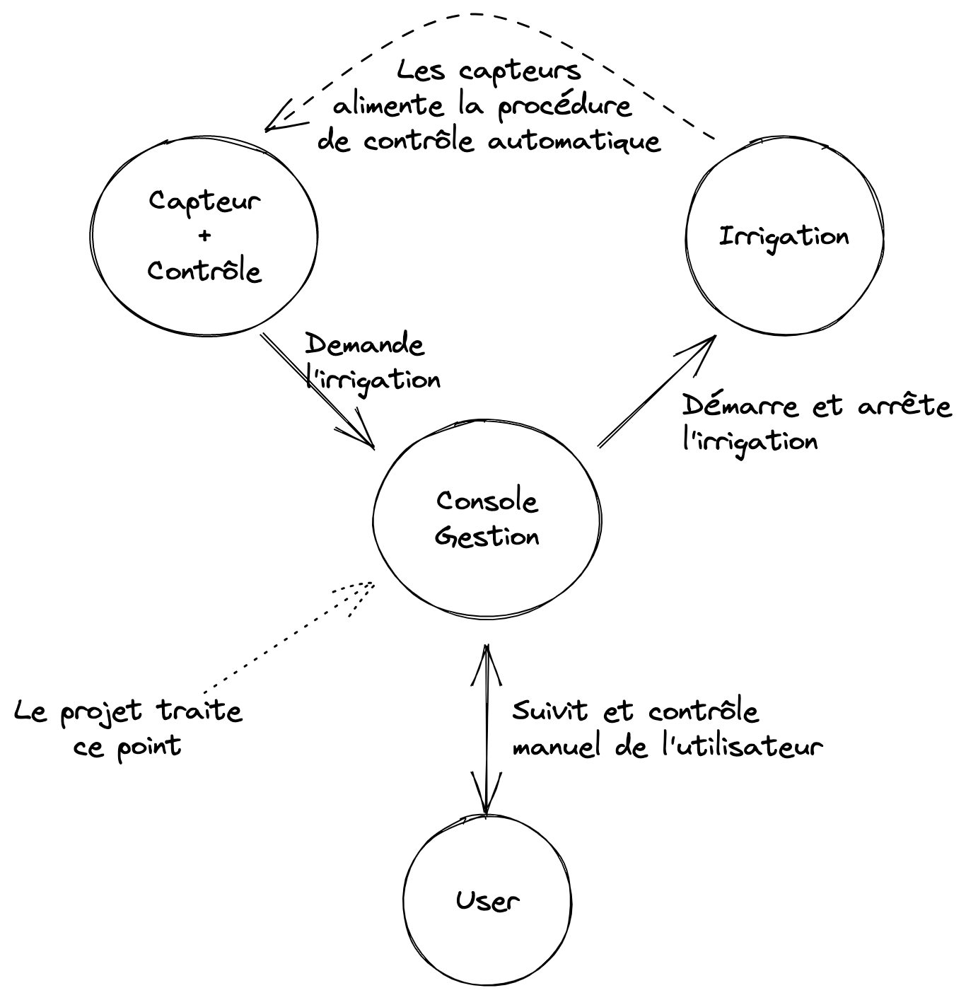

# Clock / Websocket

## Pitch

L'idée de base tourne autour d'un système d'aspersion automatique. Des capteurs remontent
des data à un système qui va contrôler l'irrigation. L'utilisateur a accès à une console web dédié pour le suivit et la gestion.

Pour l'exemple, on se concentre sur la fonctionnalité suivante :
Un écran sur lequel on peut voir l'état du système (en cours de fonctionnement ou pas) et sur laquelle on
peut voir l'historique de fonctionnement (les 10 dernières actions).
La console contient un horloge afin d'apprécier correctement les déclenchements de l'irrigation.
Les données temporelle sont envoyées par le serveur pour permettre de gérer le cas
d'un système on premise non connecté sur internet pour lequel on ne maîtrise pas la synchronisation horaire.

L'utilisateur peut contrôler le déclenchement via deux actions :
- un timer de X seconds (10 pour l'exemple)
- un mode manuel avec durée indéfinie
  Dans tout les cas il peut stopper l'action en cours ou forcer le mode manuel

Les données transmises au client via push websocket sont :
- le timestamp courant (pas de notion de timezone - timestamp local)
- le mode de l'action courante : timer, manuel, wait (pas d'aspersion)
- le timestamp de début de l'action courante (timer et manuel)
- le timestamp de fin de l'action courante (timer)

Les données sont transmises toute les secondes.

les changements de mode sont pilotés par HTTP via les endpoint
- `GET /manual`
- `GET /timer`
- `GET /stop`

Le système de controle automatique passe par ces endpoints pour lancer l'irrigation en mode timer lorsque c'est nécessaire.

L'historique est récupéré via HTTP sur le endpoint `GET /history`



## Technique

Le projet est un monorepo avec le backend python `ws-server` et le client react `react-clock`.
Pour le lancement du projet un Makefile est utilisé pour centraliser les 4 commandes utiles dans le cadre de l'exemple
(voir à la fin du document pour les commandes disponibles).

La partie backend python s'appuie sur python3 et sur `aiohttp` pour implémenter un simple serveur HTTP + Websocket.
Pour simplifier le dev, un module CORS est présent et configurer pour accepter tous les clients.
La génération des données horaires qui sont broadcast via le websocket est réalisé au travers de tâches asyncio.

La partie client s'appuie sur un projet React instrumenté par ViteJS. La connection au websocket est prise en charge via 
le module `react-use-websocket` et le hook `useWebsocket` qui permet de gérer la connection et la réception des messages.

Pour l'exemple le système de contrôle est simulé direct au sein du backend python par une fonction `simulation` qui déclenche
de manière plus ou moins aléatoire le mode timer.


## Improvement

Des TU.

Persistence de l'historique : pour l'exemple l'historique n'est pas persisté. Un minimum de persistence sur un support simple comme REDIS
permettrait d'être un peu plus propre.

Meilleur gestion des données transmise : l'objectif du websocket est de transmettre les infos d'état (mode, début et/ou fin) ET
de transmettre l'info d'horloge. Dans l'exemple toutes les données sont tout le temps transmise.
Il serait judicieux d'avoir des transmissions différentes pour ne transmettre que l'info qui change au moment ou elle change.

Un support multi-système : pour l'exemple tout les devices (système de contrôle et utilisateur) se connecte sur le même channel et
gère le même état.
Il faudrait rajouter un support multi channel (peut-etre socketIO qui intègre plus nativement ce type de mécanisme mais je ne suis pas convaincu).

Améliorer le broadcast : pour l'exemple le système de broadcast est fait de manière assez naive, ce qui pose très certainement des soucis de scaling.

Un mock du système de contrôle externe plus représentatif.

## WS Server

Bootstrap the project :
```shell
make prepare-ws-server
```
Run it :
```shell
make run-ws-server
```

Test it :
```shell
websocat ws://localhost:8001
```

## React Clock

Bootstrap the project :
```shell
make prepare-react-clock
```

Run it :
```shell
make run-react-clock
```

test it :
```shell
open http://localhost:3000
```
